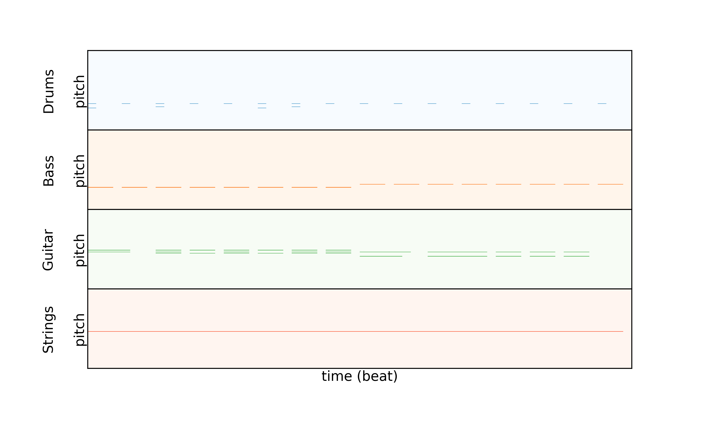
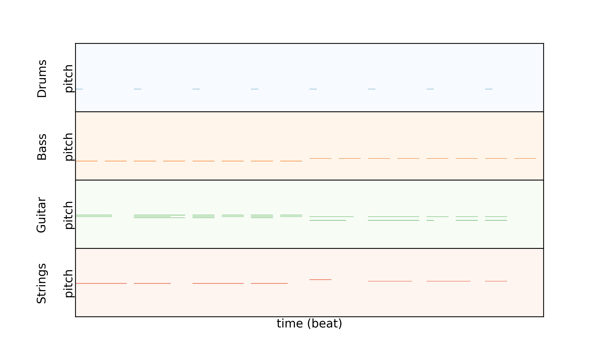

[Home]({{ site.baseurl }})

## Paper Example

**Generated** refers to the original structure/content generated by the LMD 2-bar model from a random latent code.
**Edited** refers to the new structure/content obtained by editing the generated structure.

### Generated Structure



### Edited Structure

  

