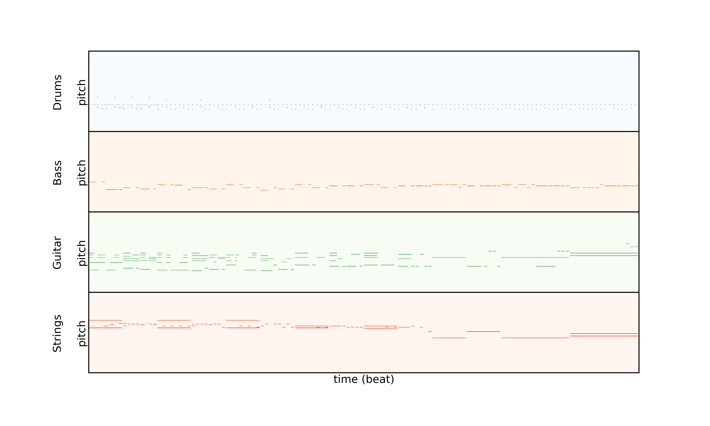
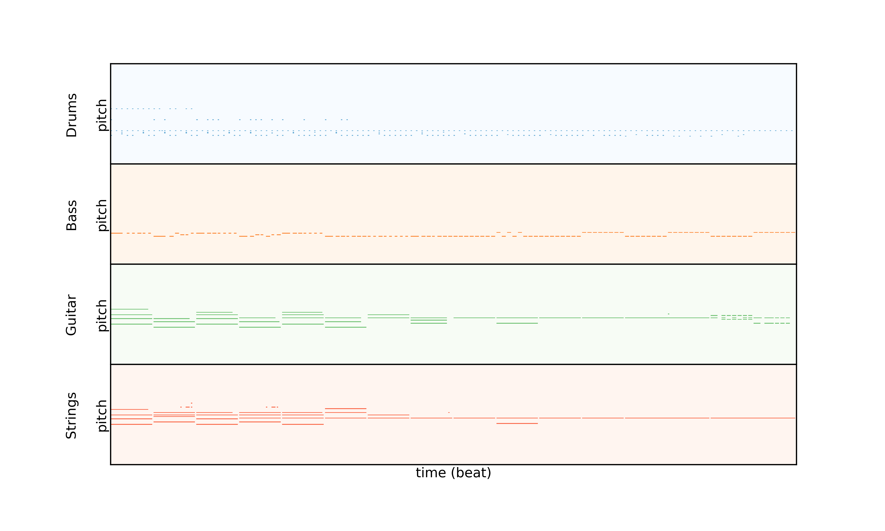
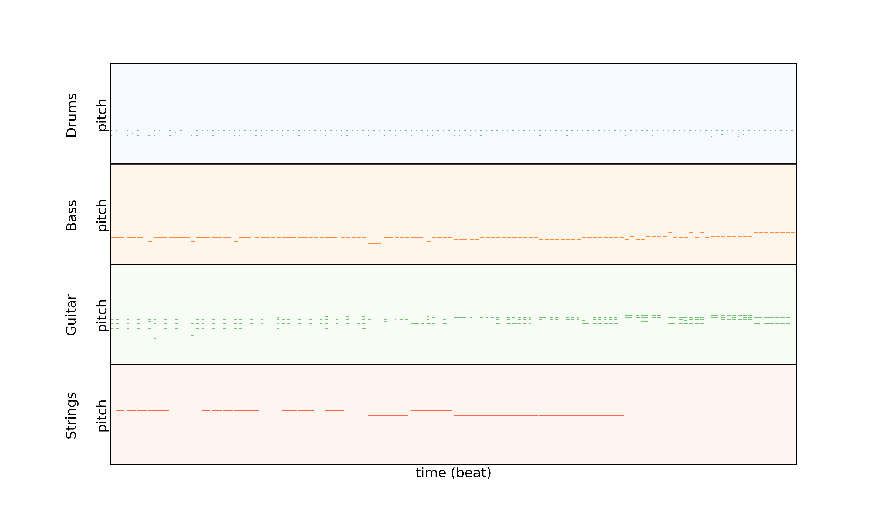

[Home]({{ site.baseurl }})

This section contains interpolations generated with the LMD 2-bar model. The initial and final samples are directly generated from random latent codes and are shown one after the other for each example. The resulting 16-bar sequences are obtained by concatenating the initial, intermediate and final audio samples ((1+6+1)*2 = 16 bars).

### Example 1





### Example 2





### Example 3



